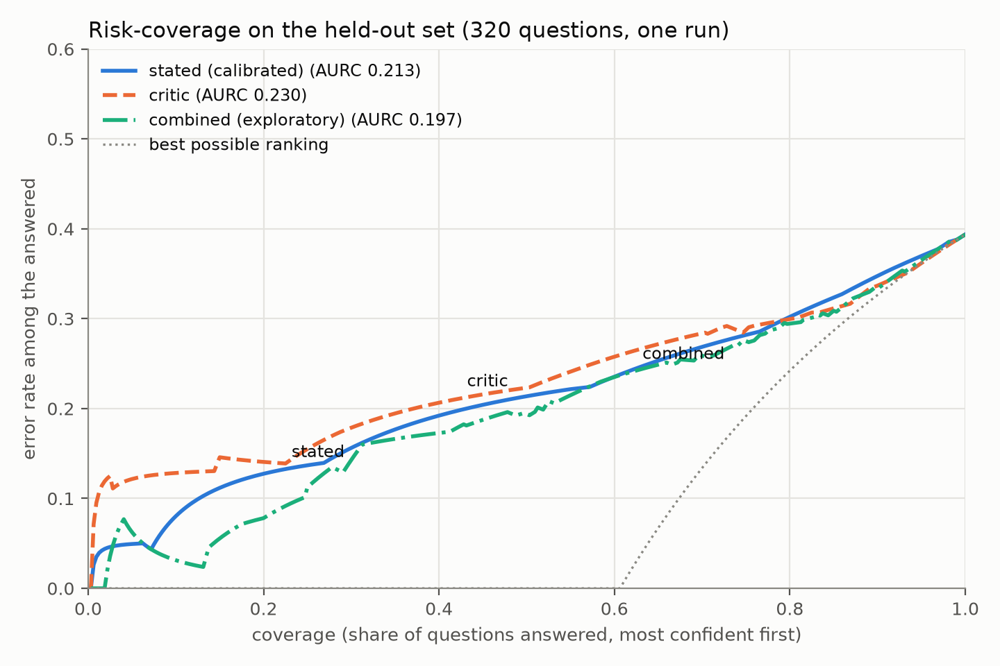
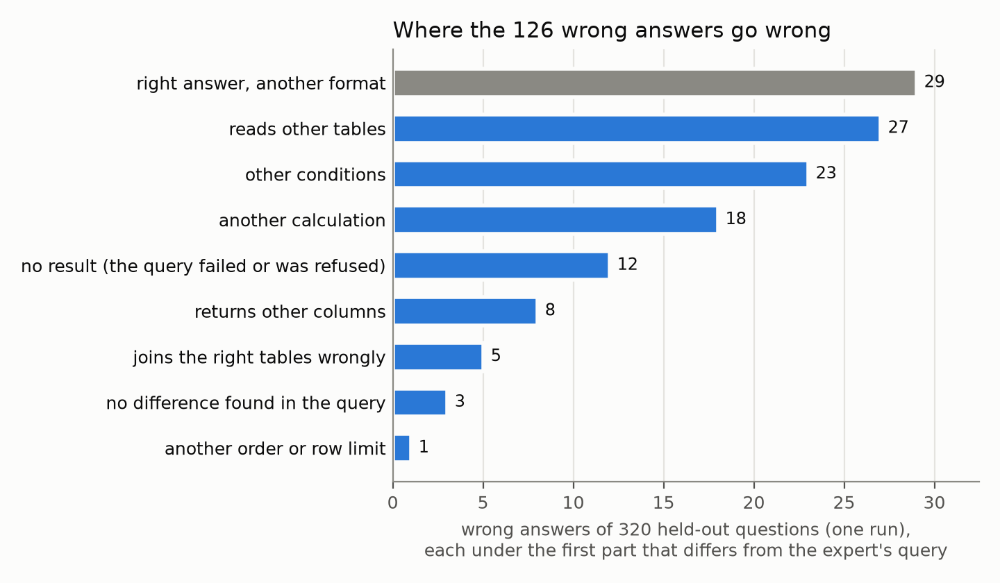
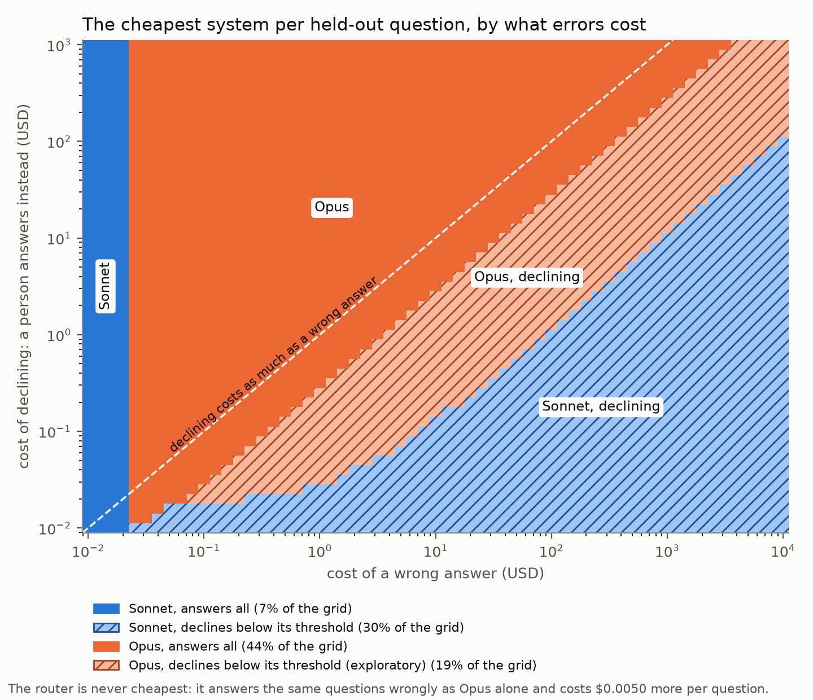
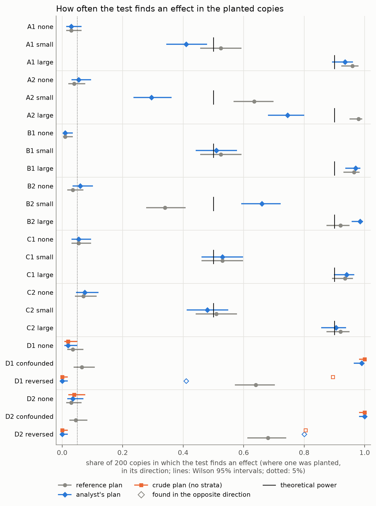
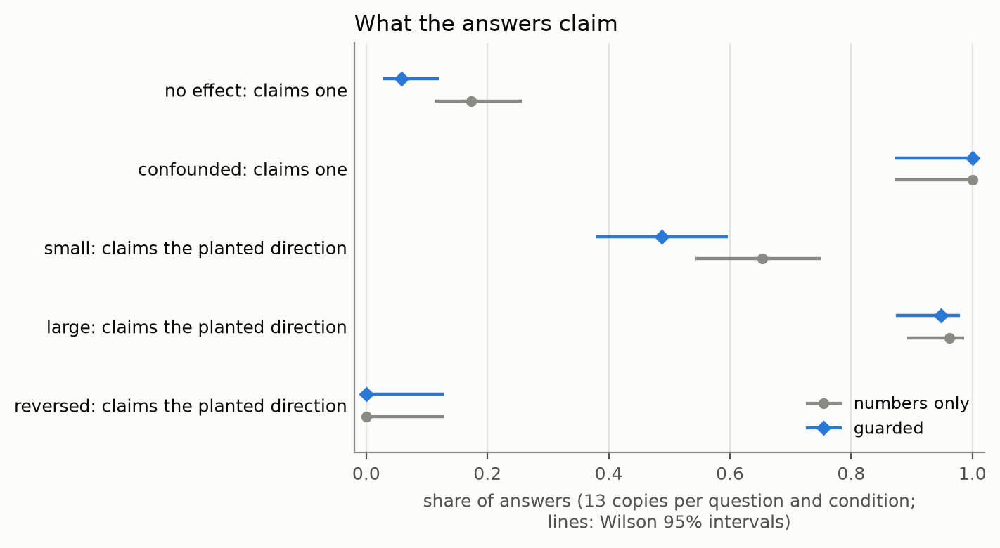
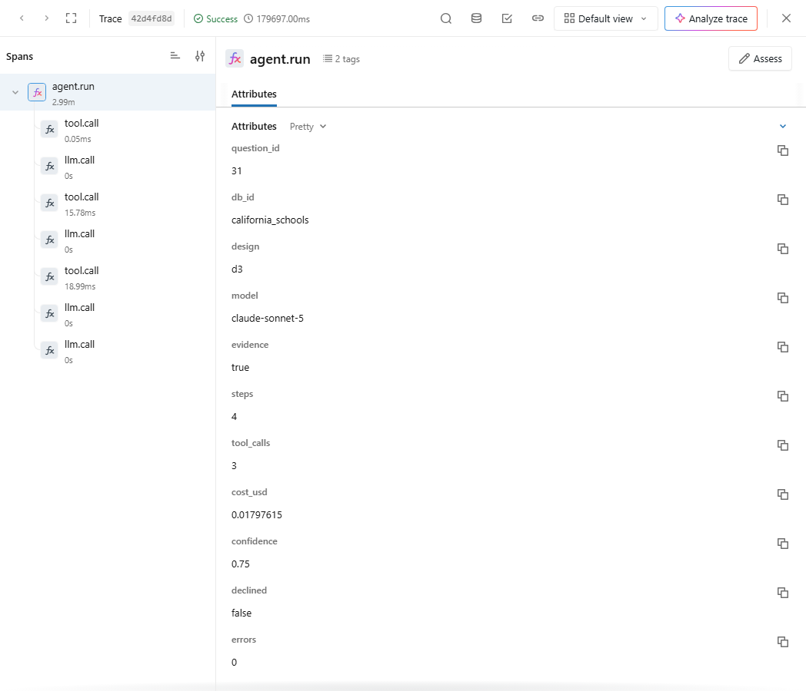
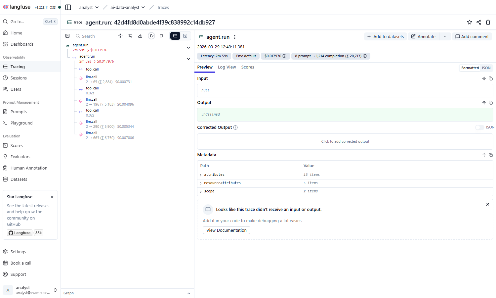

<!-- Generated by scripts/90_readme.py from docs/readme/; edit those, not this. -->
# An AI Data Analyst with Auditable Answers

*When an AI analyst answers a question about a bank's database, can it tell you how much to trust the answer, and does its confidence track whether it is right?*

This project builds an AI analyst that answers questions about a bank's database by writing and running SQL. Every answer comes with its evidence and a confidence, and the analyst declines when it is unsure. The project measures whether that confidence can be trusted.

**Status: under construction. The analyst is built, five designs of it have been compared, the chosen one has been evaluated on the benchmark and on the hand-written banking set, its confidence has been calibrated, turned into a point at which it declines, and used to route uncertain questions to a larger model, and its wrong answers have been sorted by where they go wrong and priced. A statistical guardrail now checks its comparative and causal answers. The demo comes next.**

**Auditable** means that every answer can be traced to the exact SQL, the rows it used and the checks it ran, and that it comes with a calibrated confidence. It does not mean guaranteed correct.

The full technical report is in [TECHNICAL_REPORT.md](TECHNICAL_REPORT.md). A replay demo of recorded runs will follow.

## The Idea in Plain Terms

- **Text-to-SQL** turns a question in plain English into a database query. The analyst writes the query, runs it, and answers from the rows it gets back.
- **Execution accuracy** is the share of questions for which the analyst's query returns the same rows as a query written by an expert.
- **Calibration** means the confidence matches reality: of the answers given a confidence of eight in ten, about eight in ten should be right.
- **Declining** means the analyst says it cannot answer reliably, and why, instead of guessing.
- **A statistical question** asks whether a difference, a trend or a relationship really holds, beyond the rows at hand, or whether one thing affects another. An honest answer gives the uncertainty (an interval) and says that a pattern in records nobody assigned at random need not be a cause.
- Accuracy tells you how often the analyst is right. This project measures whether it knows *which* of its answers are right, where and why it goes wrong, and what its mistakes cost.

## Key Findings

- **The simplest design won.** Of five designs, from a single call with the whole schema to an agent that explores the database, runs its own queries, corrects itself and votes over three attempts, the single call was the most accurate (59.3%, against 52.0% for the self-correcting agent and 49.3% with voting) and the cheapest ($0.0071 a question). It won by the rule fixed before any design ran.
- **Why: exploring made a strong model add things.** With the tools to run its own queries, Claude Sonnet 5 more often returned columns it had looked at but was not asked for, and the benchmark scores an extra column as wrong. Counting answers that are right in substance but wrong in form as right, the self-correcting agent all but catches up (66.0% against 66.7%, exploratory). Its single-call queries rarely failed, so self-correction had little to fix. The smaller Claude Haiku 4.5, whose queries failed more often, gained from the same tools (49.3% to 56.7%).
- **On questions nothing was tuned on**, the chosen analyst answered 60.6% of the benchmark's 320 held-out questions correctly [55.3, 65.9], at $0.0091 per correct answer. BIRD's hints matter: without them, accuracy was 17.3 points lower.
- **Its confidence ranks its answers, and calibration makes it honest.** A right answer usually gets a higher confidence than a wrong one (AUROC 0.77). The stated confidences ran too high (calibration error 0.180); adjusted on other questions, they match reality closely (0.041).
- **But declining for high accuracy leaves few answers.** Answering only when the calibrated confidence promised 90% accuracy, the analyst answered 7.2% of the held-out questions, 95.7% of them correctly. Its confidence takes too few distinct values to separate right from wrong finely.
- **A larger model was much more accurate, and the rule fixed in advance adopted it.** On the same questions Claude Opus 5.5 answered 74.0% correctly against 59.3% for Claude Sonnet 5 (14.7 points more), at $0.0149 per correct answer against $0.0119. On the held-out questions the gain held: 79.7% against 60.6%.
- **Routing only the uncertain questions to the larger model did not pay.** The analyst's confidence cleared the bar for keeping its own answer on only 23 of 320 questions, so the router sent almost everything to the larger model: it was no more accurate than the larger model alone, and cost more, since it paid for both.
- **A second model's review did not beat the analyst's own confidence, but the two together did, slightly.** A critic that sees the query's result ranked the answers no better (lower is better: 0.230 against 0.213); combining both confidences reached 0.197.
- **Most wrong answers are wrong in their logic, not their form.** Of the 126 wrong held-out answers, 29 had the right rows in the wrong shape and 12 returned nothing; the rest read other tables (27), filtered differently (23) or calculated differently (18). Reading 30 of them closely found that in 8 the benchmark's own expert query does not answer the question as asked.
- **Once a wrong answer costs more than $0.025, the larger model is the cheaper one**, although each answer costs more ($0.0102 against $0.0055): it makes fewer mistakes. Declining pays when a person's answer costs less than 0.42 times what a wrong answer costs. The router is never the cheapest choice.
- **On the hand-written banking questions**, which no model can have seen, it answered 87.5% of the standard and multi-step questions correctly, declined 100.0% of the unanswerable ones and corrected 100.0% of the false premises, while asking a clarifying question on only 4.2% of the clear questions.
- **The statistical guardrail keeps the answers true to the test, but not the test true to the question.** On copies of the bank's data with effects planted in them, answers that saw the test claimed an effect where none was planted on 5.8% of the copies, against 17.3% for answers written from the numbers alone, and never contradicted the test. But the analyst chooses what to compare within, and where a planted third factor produced the difference, it never chose that factor: its test reported the false effect on 99.5% of those copies, and the answers repeated it.
- **On the banking set's comparative and causal questions**, the analysis ran to the end on 7 of 9, each answer with an interval and the caveat that an association is not a cause; read against what each question's check asks for, 4 said all of it. Without the guardrail, the analyst had answered them without seeing any data, and none gave an interval.

- **The router became the served analyst through a rule written beforehand.** The rule asks that a new configuration be no less accurate, rank its answers no worse and fit the service's per-question reserve, each with an interval. On the 320 held-out questions the router answered 79.7% correctly against 60.6% for the single call it replaced (+19.1 pp, [+14.4, +23.8]), and ranked its answers better (area under the risk-coverage curve −0.142, [−0.188, −0.101]). Its confidence is less well calibrated (0.087 against 0.041) and a question costs $0.030 against $0.011. The rule was not blind to accuracy, which an earlier phase had reported.
- **A change to the analyst is checked before it ships, and the running service watches its own confidence.** A gate replays 26 recorded model requests from the repository alone and finds 26 unchanged. A canary that sent 23 fixed questions to the model again, for $0.35, got a valid answer to 100% of them and the same query for 70%. A drift monitor over the last 200 answers raised no alert on 0.0% of windows drawn from the held-out questions themselves, and alerted on the banking questions (index 1.03) and on traffic shifted on purpose.



*How often the analyst is wrong among the answers it keeps, keeping its most confident answers first (lower is better). Its own calibrated confidence (blue) and a second model's review (orange) rank the answers about equally well; the two combined (green, exploratory) do a little better. The dotted line is a perfect ranking. One run, 320 held-out questions.*

## How It Works

The design, being built in stages:

- **The client database.** Real, anonymized data from a Czech bank (1993–1998), with 1,056,320 transactions. It is the standard public relational banking dataset and part of the BIRD benchmark. Its codes are in Czech; translating them into business terms is what an analyst does with any bank's internal codes. A hand-written data dictionary gives every column an English name, a meaning and a unit, and translates all 35 code values found in the data.
- **The benchmark.** BIRD mini-dev, a public text-to-SQL benchmark of 500 questions over 11 databases, with an expert-written query for every question, so the analyst can be compared with published results. All 500 expert queries run on this project's database.
- **A hand-written banking test set.** 60 questions written for this project and fixed before the analyst sees them, including ambiguous, unanswerable and false-premise questions. Unlike a public benchmark, they cannot be in any model's training data.
- **The analyst.** An agent loop built directly on the Anthropic SDK, with tools to list and describe tables, look at sample rows, run queries and check chart designs.
- **Two independent guards on the database.** A SQL checker accepts only a single read-only query over the analyst's own tables. Separately, the database itself runs every query under a role that can read that one database's tables and nothing else, and stops it at a time limit. Each guard is tested on its own against the same attacks (see Results).
- **A statistical guardrail.** Comparative and causal questions take a second path: the analyst plans an analysis, its query pulls one row per unit, a tested statistics program computes the intervals in a locked-down container, and the answer is written from that result, with the observational caveat attached (see below).
- **The evaluation.** Accuracy is scored exactly as BIRD's official evaluator scores it, checked against the official code query by query (see Results). Beyond accuracy: how accuracy rises as the analyst declines its least confident answers (a risk–coverage curve), and whether its confidence is calibrated on questions it was not tuned on. The benchmark's questions are split once, before any run: 30 to write the prompts on, 150 to choose the design and calibrate confidence on, and 320 held out for the reported results. How the design will be chosen, and what is expected, is written down before the first run.

## Results

**Choosing the design.** Five designs, each adding one step to the one before, were run on the 150 questions set aside for choosing, with Claude Sonnet 5 on all five, and Claude Haiku 4.5 and a small local model on some. The winner is the design whose confidence best ranks its answers, measured by the area under the risk–coverage curve (AURC); a cheaper design wins if it is not shown to be worse.

| Model | Design | Execution accuracy | AURC (lower is better) | AUROC | Cost per question | Cost per correct answer |
|---|---|---|---|---|---|---|
| Claude Sonnet 5 | 1 single call, full schema | 59.3% [51.3, 67.3] | 0.234 | 0.72 | $0.0071 | $0.012 |
| Claude Sonnet 5 | 2 + schema tools | 53.3% [45.3, 61.3] | 0.298 | 0.75 | $0.0096 | $0.018 |
| Claude Sonnet 5 | 3 + self-correction | 52.0% [44.0, 60.0] | 0.304 | 0.74 | $0.0170 | $0.033 |
| Claude Sonnet 5 | 4 + three-sample vote | 49.3% [41.3, 57.3] | 0.368 | 0.73 | $0.0512 | $0.104 |
| Claude Sonnet 5 | 5 + schema narrowing | 52.7% [44.7, 60.7] | 0.401 | 0.63 | $0.0376 | $0.071 |
| Claude Haiku 4.5 | 1 single call, full schema | 49.3% [41.3, 57.3] | 0.360 | 0.72 | $0.0038 | $0.008 |
| Claude Haiku 4.5 | 3 + self-correction | 56.7% [48.7, 64.7] | 0.304 | 0.67 | $0.0244 | $0.043 |
| Qwen2.5 3B (local) | 1 single call, full schema | 6.7% [2.7, 10.7] | 0.914 | 0.65 | free | free |
| Qwen2.5 3B (local) | 2 + schema tools | 10.0% [5.3, 15.3] | 0.844 | 0.73 | free | free |
| Qwen2.5 3B (local) | 3 + self-correction | 11.3% [6.7, 16.7] | 0.790 | 0.80 | free | free |

<sub>Source: `results/metrics/ablation.json` (one run per design and model; the ablation set, with evidence; batched calls at half price)</sub>

- The single call wins outright: the most accurate and the best-ranked, and the cheapest. Each agentic design was less accurate than it on the same questions: the self-correcting agent by 7.3 points (the single call's lead, with its interval: +7.3 pp [+1.3, +13.3]).
- Voting over three attempts lowered accuracy (−2.7 pp [−5.3, −0.7] against the single attempt): the attempts share the model's habits, so two can agree on the same mistake and outvote a right answer.
- The small local model reached 6.7% with a single call and 11.3% with the tools, far below the hosted models.

**The chosen analyst on the benchmark.** On the 320 held-out questions it answered 60.6% correctly [55.3, 65.9]: 70.1% of the simple ones and 50.0% of the challenging ones. Answering only its most confident four in five raises that to 69.8%. On all 500 questions it scored 60.4%. Without BIRD's hints, which spell out the definitions a question relies on, it scored 42.0% on the choosing set, 17.3 points lower (the hints' gain, with its interval: +17.3 pp [+10.7, +24.0]).

**The chosen analyst on the banking set.** It answered 87.5% of the standard and multi-step questions correctly [75.0, 100.0], declined 100.0% of the unanswerable ones with a reason, and corrected 100.0% of the false premises. A check by hand of what it said confirmed 100.0% of the corrections; of the ambiguous questions, 88.9% were handled well after the check (88.9% by the automatic rule, which counts any clarifying question). On the clear questions it asked for clarification on 4.2%.

<sub>Source: `results/metrics/benchmark_main.json`, `results/metrics/own_set.json`, `results/reviews/own_set_review.yaml` (one run each)</sub>

**Calibrating the confidence and declining.** Fitted on the 150 questions set aside for it and checked on the 320 held-out ones:

- The stated confidence ran too high: its calibration error was 0.180. After calibration it was 0.041 [0.033, 0.099].
- To be right 90% of the time, the analyst may only answer when it states a confidence of at least 0.92. On the held-out questions that meant answering 7.2% [4.4, 10.0] of them, 95.7% correctly.
- A second model, shown the question, the SQL, the rows it returned and the checks, ranked the answers no better than the analyst's own confidence (the difference in AURC: +0.017 [−0.019, 0.056]). Combined, the two did slightly better (−0.016 [−0.033, −0.001], exploratory).
- Of the wrong answers whose query ran, 29 of 114 held the right rows, with extra or reordered columns or other rounding. Counted as right, they would lift the held-out accuracy from 60.6% to 69.7%; execution accuracy, which counts them wrong as the benchmark does, stays the measure everywhere else.

<sub>Source: `results/metrics/calibration.json`, `results/metrics/risk_coverage.json`, `results/metrics/benchmark_main.json`, `results/metrics/near_miss.json` (one run each)</sub>

**Escalating to a larger model.** On the 150 questions set aside for choosing, Claude Opus 5.5 was +14.7 pp [+7.3, +22.0] more accurate than Claude Sonnet 5 on the same design, so the rule fixed in advance adopted it. The router it brings in sends Opus the held-out questions Sonnet is unsure of (297 of 320):

- The routed system answered 79.7% [75.3, 84.1] of the held-out questions correctly, against 60.6% for Sonnet alone (+19.1 pp [+14.4, +23.8]), at $0.0191 per correct answer against $0.0091.
- Opus alone, run on every held-out question as an extra comparison, scored the same, 79.7%, at $0.0129 per correct answer: on the few questions the router kept, both models got the same ones right. Routing pays for a Sonnet answer first and then sets most of them aside.
- Costs are at the batch price. When the batches stalled for hours, Opus's last 190 held-out questions were sent as direct calls at twice the price; its answers do not depend on how a request is sent.

<sub>Source: `results/metrics/escalation.json`, `results/metrics/router.json` (one run per model)</sub>

**The same pipeline in a framework.** Rebuilt with LangGraph (an orchestrator routing between a SQL agent and the reviewing model), the pipeline sent exactly the same requests on all 150 questions, so its answers and accuracy are identical. Its overhead per question was 37 ms at the median, against 30 ms for the hand-written loop, and it saved 7 checkpoints of its state each time. The hand-written loop stays the main system.

<sub>Source: `results/metrics/framework_comparison.json` (one run, from stored responses)</sub>

**Checking the scorer.** Before scoring the analyst, the project's scoring was run beside BIRD's official evaluator on 2,032 test queries: the 500 expert queries themselves, 1,499 expert queries altered on purpose (a missing DISTINCT, a flipped sort, a dropped filter, a cast to another type) and 33 hand-written edge cases.

- The two gave the same verdict on 2,032 of the 2,032, including the 550 altered queries that still return the right rows. The secondary score (Soft-F1) matched to the last digit on 2,032.
- Three kinds of query that the official evaluator runs are refused here by design: a second statement, a setting changed before the query, and another database's tables. The analyst's own tools refuse them before they run, so no answer of the analyst can meet them.
- With PostgreSQL's default parallel query switched on, the official evaluator scored 2 of the 500 expert queries wrong against themselves: their floating-point sums came out differently on each run. Every query here runs without it.

<sub>Source: `results/metrics/ex_validation.json` (one run)</sub>

**The database guards.** A suite of 95 attacks tried to change data, run a hidden second statement, disguise SQL with comments or look-alike characters, read settings, files and other databases' tables, change session settings, tie up the server, and do what a planted instruction in the data asks. Each guard ran the suite with the other switched off:

| Kind of attack | Attacks | Stopped by the checker alone | By the database alone | By the role's privileges alone |
|---|---|---|---|---|
| Destructive statements | 20 | 20 | 20 | 20 |
| Several statements in one | 7 | 7 | 7 | 7 |
| Comment and unicode obfuscation | 19 | 19 | 18 (+1 names listed) | 18 (+1 names listed) |
| Catalog, file and network snooping | 22 | 22 | 19 (+3 names listed) | 19 (+3 names listed) |
| Another database's tables | 4 | 4 | 4 | 4 |
| Changing session settings | 8 | 8 | 8 | 8 |
| Resource exhaustion | 12 | 12 | 12 | 12 |
| What a planted instruction asks for | 3 | 3 | 3 | 3 |

<sub>Source: `results/metrics/security_suite.json` (one run)</sub>

- No attack got past either guard on its own (0 breaches), apart from listing table names, below.
- For runaway queries, "stopped" means cut off by the time and row limits, which stay on whichever guard is switched off. No checker can tell an expensive query from a legitimate one, so these queries are contained, not refused.
- The database cannot hide the names of its tables from a user who can connect. Only the checker stops the 4 queries that list them; the data behind the names stays out of reach.
- All 500 expert queries of the benchmark pass the checker, and return exactly the same rows through the analyst's tools.

## Where It Goes Wrong and What Errors Cost

**Where the analyst gets it wrong.** Each of the 126 wrong held-out answers was put in one category by the first part of its query that differs from the expert's:

- 12 returned no result (9 refused by the SQL checker, 3 failed), and 29 had the right rows in the wrong shape.
- 82 are mistakes of logic: 27 read other tables, 23 used other conditions, 18 calculated differently, 8 returned other columns, 5 joined the right tables wrongly and 1 kept other rows. In 79 of the 126, more than one part differs.
- In the last 3, none of these parts differs from the expert's query, and the difference lies elsewhere.
- A close reading of 30 of them agreed with the automatic category on 17; where they differ, the automatic one had mostly stopped at a harmless first difference, before the real mistake. It also found 8 whose expert query does not answer the question as asked, for example counting lab records where the question asks for patients. The author checked 5 of the answers flagged this way and kept the flag on 4, dropping the other from the count.



<sub>Source: `results/metrics/error_analysis.json`, `results/reviews/error_hand_check.yaml` (one run)</sub>

**What errors cost.** Nobody knows in general what a wrong answer costs, or what it costs for a person to answer a question the analyst declines, so no price is assumed. Instead, each system's expected cost per question was worked out for every pair of costs, from a cent to $10,000 for a wrong answer and from a cent to $1,000 for a declined question:

- Opus alone is cheaper than Sonnet alone once a wrong answer costs more than $0.025 (95% interval $0.017 to $0.036). Below that, the cheaper model's extra mistakes cost less than the larger model's price.
- The router is never the cheapest: it gets exactly the same questions wrong as Opus alone and costs $0.0050 more per question.
- Declining is worth it only when a person's answer is cheap next to a wrong one: for Sonnet, below 0.42 times the cost of a wrong answer.
- Deciding question by question from the calibrated confidence works only as well as the calibration does. It is the cheapest rule in principle, but for Opus, whose confidence was calibrated on few questions, the fixed threshold sometimes did better.



*Which system has the lowest expected cost per question, at each cost of a wrong answer (across) and of a declined question (up). Blue is Sonnet and orange is Opus; the hatched areas decline their least confident questions. Opus declining is exploratory: its threshold was chosen the same way as Sonnet's. One run per model, 320 held-out questions, batch prices.*

<sub>Source: `results/metrics/decision_analysis.json` (one run per model, no model calls)</sub>

## The Statistical Guardrail

Some questions ask whether something holds, not what the rows say: do loans to women go bad more often, did card withdrawals become more common, does a pension protect against overdrafts? Answered from the rows alone, such a question invites a confident claim that the data cannot support. The guardrail sends these questions down a second path:

1. **Flag.** Keyword rules and Claude Haiku 4.5, reading the question alone, flag it as statistical if either says so.
2. **Plan.** Claude Sonnet 5, reading the schema but no data, plans the analysis: a query returning one row per unit (a loan, a client), the outcome, the groups or the trend to compare, and up to two variables to compare within, in case one of them produces the difference.
3. **Analyze.** The query runs through both database guards. A tested statistics program computes the intervals and tests in a container with no network, a read-only file system and no privileges, and checks whether the result holds within the chosen variables.
4. **Answer.** Sonnet writes the answer from that result. The reader gets it with the interval, any warning (few cases, or areas rather than people), a correction wherever the answer's claim and the test disagree, and the caveat that records nobody assigned at random show associations, not causes.

**Which questions it flags.** It flagged 9 of the 9 comparative and causal questions in the banking set and 8 of the 8 planted ones (below). It also flagged 4 of the banking set's other 51 questions, most of which the plan then declined (the data does not record what they ask about, or their premise is false), and 6 of the 470 benchmark questions (1.3%), all of them counts or lookups on reading.

**The banking set's comparative and causal questions.** Before the guardrail, the analyst answered them in one call, without seeing any data; none gave an interval, and several said "no real difference" where the data shows a clear one.

|  | Question | Before | Path ran | After | After, reviewed |
|---|---|---|---|---|---|
| own-f01 | Did giving clients a card make them more likely to take out a loan? | no | yes | yes | no |
| own-f02 | Are loans to women repaid worse than loans to men? | no | yes | yes | no |
| own-f03 | Do weekly statements lead to more overdrafts? | no | yes | yes | no |
| own-f04 | Do clients in districts with higher unemployment default on their loans more often? | no | yes | yes | yes |
| own-f06 | Do older clients keep higher balances? | no | yes | yes | yes |
| own-f07 | Are gold card holders more active than classic card holders? | no | no (timeout) | no | no |
| own-f09 | Did withdrawals by card become more common between 1996 and 1998? | no | no (refused) | no | no |
| own-f10 | Does receiving an old-age pension protect clients from overdrafts? | no | yes | yes | yes |
| own-f11 | Are loans on accounts with a second authorised user repaid better, because two people share responsibility? | no | yes | yes | yes |

<sub>Source: `results/metrics/guardrail.json`, `results/reviews/guardrail_review.yaml` (one run; reviewed by reading against each question's recorded check and the expert query's result)</sub>

- On 7 of 9, the path ran to the end and the answer met every criterion fixed in advance: an interval, no causal claim, the caveat, and a warning where the counts are small. Of the other two, one plan's query ran past the time limit and the SQL checker refused the other's cross join.
- Read against what each question's check asks for, 4 said all of it. The others missed the specific caveat the check names (for example, that most card holders got their card only after their loan was granted, so the card cannot have led to it), or pooled groups the check asks to compare.

**Planted effects: does the test find what is there?** Effects of known size were planted in copies of the bank's loans: 200 copies of each of eight questions under each condition, two questions each on rates, means and trends (no effect, a small one or a large one), and two where a third factor produces a difference or hides a real one pointing the other way. Each copy was analyzed with the analyst's plan and with a reference plan written beforehand.

- **The test is sound.** With the reference plans, it found an effect where none was planted in 4.0% of the copies (it is built for one in twenty), found planted effects about as often as theory predicts in 10 of 12 cases, and saw through a planted third factor: a false effect in 5.5% of those copies, against 100% without comparing within the factor.
- **The analyst's plans are the weak point.** It never chose to compare within the planted third factor, so its test reported the false effect on 99.5% of those copies, and where a real effect pointed the other way, it found that effect pointing the wrong way in 60% of the copies and the right way in none. Comparing within a variable that nearly fixes the groups also cost it power: a district's average salary nearly decides whether the branch is in Prague, and on one question the analyst's plan found a large planted effect in 74% of the copies, against 98% for the reference plan.



*Per question and condition, the share of 200 copies in which the test found an effect, in the planted direction where one was planted (hollow marks: found in the opposite direction). Gray: the reference plan; blue: the analyst's; orange: the reference plan without comparing within the third factor. Black ticks: the theoretical power. One run.*

**Planted effects: what do the answers say?** On the first 13 copies of each question and condition, Sonnet answered twice: once from the numbers alone (each group's size and share or mean) and once from the guarded input, with the test.

- Where nothing was planted, the guarded answers claimed an effect on 5.8% of the copies, only where the test itself had a false alarm, against 17.3% from the numbers alone. Over all copies without an effect, the pre-registered measure, the guardrail lowered the claims from 33.9% to 24.6% (−9.2 pp, [−15.4, −3.8]); it did not lower them more because, where a third factor produced the difference, both kinds of answer claimed it every time: the guarded answer follows the test, and the test followed the analyst's plan.
- The guarded answers never contradicted the test (0 of 311); those from the numbers alone did 48 times. Where a small effect was planted, the guarded answers claimed it less often (49% against 65%): the test finds a small effect only about half the time, and the guarded answers claim no more than it finds.
- Read sentence by sentence, 0 guarded answers and 1 from the numbers alone claimed a cause, counting a claim that one thing does not affect another.



*The share of answers that claim an effect where none was planted (top two rows) and that claim the planted direction where one was (bottom three), from the numbers alone (gray) and guarded (blue). One run, 13 copies per question and condition.*

**The sandbox.** Each analysis runs in a fresh container with no network, a read-only file system, an unprivileged user and limits on time, memory, processes and output. It was attacked as if it ran hostile code:

| Kind of attack | Attacks | Blocked | How |
|---|---|---|---|
| Reach the network or the host | 8 | 8 | 1 absent, 7 denied |
| Write, execute or read files | 12 | 12 | 3 absent, 1 contained, 8 denied |
| Gain privileges | 7 | 7 | 7 denied |
| Find secrets | 2 | 2 | 2 absent |
| Exhaust time, memory, processes or output | 10 | 10 | 10 contained |
| Malformed or oversized input | 8 | 8 | 3 handled, 5 rejected |

<sub>Source: `results/metrics/sandbox_security.json` (one run)</sub>

- 47 of the 47 attacks were blocked: what they looked for was absent, the operating system denied it, a limit contained it, or the runner rejected or correctly handled the malformed input. For each protection, the same attack was also run with that protection switched off, and it succeeded (11 of 11), so the attacks are real and each protection is what stops them.

Of the guardrail's 13 predictions, fixed before the first paid call, 6 held; the technical report lists them.

<sub>Source: `results/metrics/guardrail.json`, `results/metrics/planted_effects.json`, `results/reviews/guardrail_review.yaml`, `results/metrics/sandbox_security.json` (one run each)</sub>

## Operating It

The analyst is a service, so the questions are the ones any service raises: what did it do, which version is this, did a change make it worse, and is it drifting.

- **Traces in two tools.** Every run writes one span per model call and tool call. They go over OpenTelemetry to MLflow and, by a second exporter, to a self-hosted Langfuse, so the same run can be read in both. Langfuse shows tokens and cost for each model call, which MLflow's trace view does not; MLflow keeps the traces beside the experiment runs. 27 evaluated runs are logged to MLflow as a view rebuilt from the committed results, never the other way round.
- **A registry.** An agent configuration is the prompt files, the model's request settings, the calibrators, the decline threshold and the router, hashed together. The committed registry names the champion; MLflow's model registry mirrors it. The service loads the champion at start.
- **A rule for promotion**, in place before the challenger's ranking was computed (see the findings above), and a log of every decision.
- **A gate in CI.** It rebuilds the model requests from the repository and compares them and the parsed answers with the recorded ones, so a prompt or schema change that alters what the model would be sent fails the build. It needs no database, no benchmark and no key.
- **A canary.** A manual workflow with a spend cap sends 23 fixed requests to the model with no cache and compares with the recorded answers. Model outputs are samples, so a flag asks for a look and is not a verdict. The first run cost $0.35 against a cap of $0.75.
- **Drift and alerts.** The service measures how the calibrated confidence of its last 200 answers differs from the held-out record its meter rests on (a population stability index; warning at 0.10, alert at 0.25), and the share of answers it holds back. Prometheus evaluates the alert rules, tested with its own tooling, and Grafana shows a dashboard that is code. Sent 140 answers of one kind, the index read 6.3 and the alert fired, then cleared after a restart.
- **A static demo.** The same page reads the 20 recorded runs from 41 plain files, so it can be hosted on GitHub Pages with no server behind it.

Replayed traffic is not live traffic, and the drift numbers are from recorded answers: they show that the monitor does not cry wolf on its own reference and does sound on a real shift, not how often real traffic would shift. The technical report has the numbers and what they do not show.





*One recorded run of the self-correcting design, sent to both tools from the stored spans. The recorded batch calls carry no timing, so the model calls show no duration here.*

## Try It

- **Public demo:** TBD. It will replay recorded runs only: no key and no database on the host.
- **Locally, replaying recorded runs (no key needed):** `docker compose up -d --wait`, then open http://127.0.0.1:8000. The page replays 20 recorded runs as they streamed: the steps, the query and what it means in words, the rows it used, the checks it ran, the answer and what its confidence means. 20 of 20 replay exactly as they were evaluated, and the page says, after each, whether the evaluation scored it right. The runs were drawn by a rule fixed before looking at them, so wrong answers and held-back ones are in the set.
- **Locally, asking your own questions:** put an API key in `.env`, load the benchmark (see the technical report), and run `uv run python -m src.serving --mode live`. A question costs a few cents; the service keeps its own spend ledger and cap, and refuses new questions when the cap is reached. It has no sign-in and no rate limit: it is meant for one person on their own machine, answers only to localhost names, and is not for exposing to a network. A question that asks for a comparison or a cause also gets the statistical analysis, which needs Docker on the machine; inside the compose stack it is off, and the answer says so.
- **Your own PostgreSQL (live mode, on your machine only):** the page can point the analyst at your database. It first checks that the role can only read and refuses a role that can write, listing what to change. The confidence is not calibrated for your data, and the page says so.

Beside each answer the page states the result in one plain line built from the rows (the analyst writes its sentence before it sees them), and an answer with its evidence can be copied as Markdown. When the evaluation scored an answer wrong, the page shows what the right answer was beside the analyst's result, a short note in plain words on why the two differ (a real mistake, another fair reading of the question, or an expert answer that departs from its own hint), and, behind a link, the expert's query. The analyst never saw that query; it is shown after the fact.

The page's confidence meter quotes only what was measured: how often answers at that calibrated confidence were right on held-out benchmark questions, with the interval and how many questions it rests on.

<sub>Source: `results/metrics/serving_check.json`, `results/metrics/calibration.json`</sub>

### Use it from an MCP client

The same guarded, read-only tools are available to any [MCP](https://modelcontextprotocol.io) client over stdio: list the tables, describe one, sample rows, look up what a code means in the data dictionary, and run one `SELECT`. Add this to your MCP client's configuration (the file where it lists its servers), with the path of this repository, and start the database first (`docker compose up -d --wait postgres`):

```json
{
  "mcpServers": {
    "ai-data-analyst": {
      "command": "uv",
      "args": ["run", "--directory", "C:/path/to/ai-data-analyst", "python", "-m", "src.mcp_server"]
    }
  }
}
```

It serves the Czech bank database. To serve your own PostgreSQL instead, set `ANALYST_MCP_PG_HOST`, `ANALYST_MCP_PG_PORT`, `ANALYST_MCP_PG_DBNAME`, `ANALYST_MCP_PG_USER`, `ANALYST_MCP_PG_PASSWORD` and, if it is not `public`, `ANALYST_MCP_PG_SCHEMA` in the server's `env`; a role that can write is refused at start. Every call goes through the same query checker, read-only transaction, row cap and time limit as the analyst's own. The security suite was sent through this server by a real MCP client: 95 attacks on the query tool and 19 on the tools' arguments, with 0 breaches.

<sub>Source: `results/metrics/mcp_security.json` (one run)</sub>
## Reproducing the Results

- Needs Python 3.12 with [uv](https://docs.astral.sh/uv/), and Docker.
- The database runs in Docker. The data pipeline downloads the benchmark (about 800 MB), loads it and runs every expert query. Every model response is cached, so replaying the results costs nothing.
- The technical report has the details.

```
uv sync
docker compose up -d --wait
uv run dvc repro
uv run pytest
```

## Limitations

- Every result is from one run; the intervals show how much it could move with other questions, not with another run.
- The benchmark scores an answer's rows exactly: an extra column, or a number of another type, makes an otherwise useful answer wrong. Part of the agentic designs' loss is of this kind.
- The calibration and the decline threshold were set on 150 questions, so they carry the uncertainty of a small sample.
- 11 of the benchmark's expert queries compute ages from today's date, so their correct answers change over time. The scorer runs them beside each answer, but a stored answer that fixed a year can go out of date.
- The cost analysis prices every wrong answer the same and assumes a person answers a declined question correctly. It shows which system is cheapest for any pair of costs, not what the costs are.
- The error categories read the structure of a query, not its intent, so a harmless difference can hide the real mistake behind it.
- The security results are from one run of a fixed set of attacks. They show that each guard stops these attacks, not that no other attack exists.
- The guardrail is only as good as the analysis the analyst plans: it computes the plan's test correctly but cannot see a third factor the plan leaves out, and the planted copies show that the analyst missed such factors. Its planted effects are simple and of known form; real effects are not.
- Whether a guarded answer meets each question's check was judged by reading, by one reader, on nine questions.
- BIRD's questions are public and may be in the models' training data. The hand-written banking set exists to check for that.

## Dependencies

| Component | Used for |
|---|---|
| Python, uv | the code and its locked environment |
| PostgreSQL, in Docker | the databases, with a read-only role for the analyst |
| Anthropic Python SDK | the analyst's model calls |
| Ollama | a free local model for comparison |
| psycopg | database access from Python |
| sqlglot | the SQL checker's parser |
| jsonschema, Vega-Lite schema | checking the analyst's chart designs |
| NumPy | bootstrap intervals |
| SciPy, statsmodels, pandas, in Docker | the guardrail's statistics, in a locked-down container |
| MLflow, DVC | experiment tracking, a model registry view and data versioning |
| OpenTelemetry (OTLP/HTTP exporter) | the traces sent to MLflow and Langfuse |
| Langfuse, Prometheus, Grafana, in Docker | a second trace viewer, metrics, alerts and a dashboard |
| LangGraph | the framework comparison only |
| Matplotlib | the figures |
| FastAPI, uvicorn | the service that streams a run's steps |
| MCP Python SDK | the tool server for MCP clients |
| prometheus-client | the service's metrics |
| React, Vite, Tailwind CSS, Vega-Embed, highlight.js | the page: steps, evidence, charts |
| Inter, JetBrains Mono (bundled fonts) | the page's type |
| Playwright, axe-core | browser tests and an automated accessibility audit of the page |

<sub>Source: `pyproject.toml`, `docker-compose.yml`</sub>

## References

Li, J., et al. (2023). *Can LLM Already Serve as a Database Interface? A BIg Bench for Large-Scale Database Grounded Text-to-SQLs* (BIRD). NeurIPS Datasets and Benchmarks. Data licensed CC BY-SA 4.0.

Berka, P. (1999). *Guide to the Financial Data Set*. PKDD'99 Discovery Challenge.
