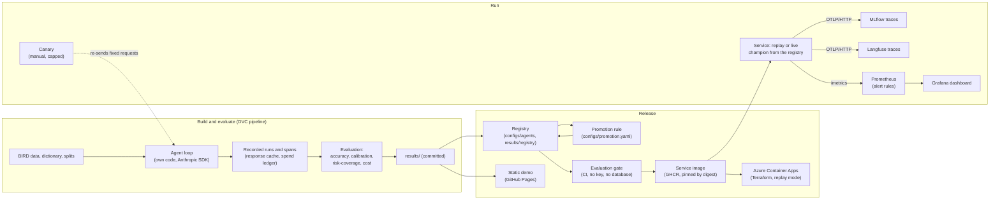

# Architecture

How the pieces fit together, and where each one is checked. No result numbers live here; they are in the README and the technical report, rendered from the committed results.



## What is checked where

| Piece | Checked by |
|---|---|
| The pipeline's results | `dvc repro`, and a forced rebuild of a clean copy compared with the committed files (`scripts/92_reproduction_check.py`) |
| A change to prompts, schema rendering or request settings | the evaluation gate (`scripts/89_eval_gate.py`): rebuilds each recorded request and compares its hash |
| Which agent configuration is served | the registry's `champion` alias; the promotion rule decides a change |
| The model, as it is today | the canary (`scripts/91_canary.py`): a fixed list of requests, no cache, a spend cap |
| The confidence the service reports | the drift monitor (`src/serving/drift.py`), `scripts/93_drift_check.py` offline and `scripts/94_alert_check.py` through Prometheus |
| The alert rules and the dashboard | `promtool test rules` and a test that every series they use is exposed by the service |
| The static demo | a test comparing each file with what the service returns, and a browser test with no API behind it |
| Delivery | images pinned by digest, third-party actions pinned by commit, a publish workflow that runs the gate first |
| The cloud deployment | `terraform validate` in CI; once deployed, `scripts/98_cloud_check.py` from outside |

## Traces

The agent writes OpenTelemetry spans (one per run, model call and tool call) to `data/spans/`. Two exporters can send them on, over OTLP/HTTP and without either vendor's SDK: one to MLflow, one to Langfuse, which takes its own attribute names added at export. A recorded run's spans can be sent again with their original identifiers (`scripts/85_export_traces.py`), so no model call is needed to look at a run in either tool.

MLflow's experiments (`scripts/84_mlflow_runs.py`) and model registry (`scripts/86_registry.py`) are views built from committed files. Deleting the MLflow store loses nothing.

## Modes of the service

- **Replay:** serves recorded runs only, with the timing they were recorded with. No key, no database. This is what the compose file starts, what the image runs by default and what the static demo mirrors from plain files.
- **Live:** runs the champion on the benchmark database, through the response cache and a spend ledger with its own cap, checked before each question. Meant for one person on their own machine.

## Running it

```
docker compose up -d --wait                                        # service (replay), http://127.0.0.1:8000
docker compose --profile tracing up -d --wait                      # also MLflow (5000) and Langfuse (3000)
docker compose --profile monitoring up -d --wait                   # also Prometheus (9090) and Grafana (3001)
```
